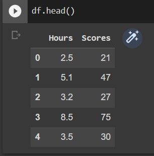
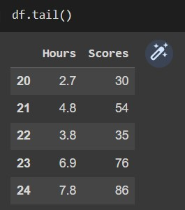

# Implementation-of-Simple-Linear-Regression-Model-for-Predicting-the-Marks-Scored

# Aim:
To write a program to predict the marks scored by a student using the simple linear regression model.

# Equipments Required:
1. Hardware – PCs
2. Anaconda – Python 3.7 Installation / Jupyter notebook

# Algorithm
### Step1:
Import the needed packages.
### Step2:
Assigning hours To X and Scores to Y.
### Step3:
Plot the scatter plot.
### Step4:
Use mse,rmse,mae formula to find.

# Program:
```
'''
Program to implement the simple linear regression model for predicting the marks scored.
Developed by: Akash A
RegisterNumber: 212221230003
'''

import numpy as np
import pandas as pd
df=pd.read_csv('student_scores.csv')

X=df.iloc[:,:-1].values
Y=df.iloc[:,1].values
print("X=",X)
print("Y=",Y)

from sklearn.model_selection import train_test_split
X_train,X_test,Y_train,Y_test=train_test_split(X,Y,test_size=1/3,random_state=0)

from sklearn.linear_model import LinearRegression
reg=LinearRegression()
reg.fit(X_train,Y_train)

Y_pred=reg.predict(X_test)
import matplotlib.pyplot as plt
from sklearn.metrics import mean_absolute_error,mean_squared_error

plt.scatter(X_train,Y_train,color='red')
plt.plot(X_train,reg.predict(X_train),color='yellow')
plt.title('Training set(H vs S)',color='blue')
plt.xlabel('Hours',color='green')
plt.ylabel('Scores',color='green')

plt.scatter(X_test,Y_test,color='black')
plt.plot(X_test,reg.predict(X_test),color='blue')
plt.title('Test set(H vs S)',color='green')
plt.xlabel('Hours',color='brown')
plt.ylabel('Scores',color='brown')

mse=mean_squared_error(Y_test,Y_pred)
print('MSE = ',mse)

mae=mean_absolute_error(Y_test,Y_pred)
print('MAE = ',mae)

rmse=np.sqrt(mse)
print('RMSE = ',rmse)

```
# Output:


### Training Set:

### Test Set:

### Mean Squared Error:

### Mean Absolute Error:

### Root Mean Squared Error:


# Result:
Thus the program to implement the simple linear regression model for predicting the marks scored is written and verified using python programming.
